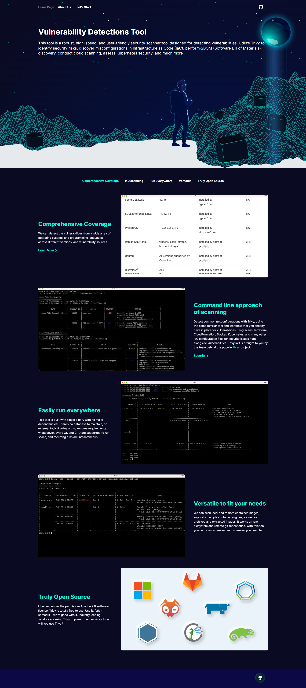

# Vulnerability Detections



Vulnerability Detections is a robust security scanner tool designed for detecting vulnerabilities, identifying misconfigurations in Infrastructure as Code (IaC), performing SBOM (Software Bill of Materials) discovery, conducting cloud scanning, assessing Kubernetes security, and more.

## Supported Scanning Types

1. **GitHub Repository Scanning** : Repo scanning is a security tool that scans GitHub repositories to identify vulnerabilities and their associated files.

2. **Container Image Scanning** : Scans container images to identify vulnerabilities.

3. **File System Scanning** : Scans the file system to identify vulnerabilities.

## Getting Started

To start using Vulnerability Detections, follow these steps:

1. [Installation](#installation)
2. [Usage](#usage)
3. [Documentation](#documentation)
4. [Contributing](#contributing)
5. [License](#license)

## Installation
Main prerequisite is the nodejs should be installed, To install please follow https://nodejs.org/en/download

```bash
# Clone the repository
git clone https://github.com/girikMET/vuln_detections_cs602.git

# Navigate to the project directory
cd vuln_detections_cs602

# Install dependencies
npm install package.json

# Start the appliaction
node server.js
```

## Documentation
For detailed documentation and additional resources, visit the official documentation https://github.com/girikMET/vuln_detections_cs602/blob/master/README.md

## Contributing
We welcome contributions from the community. If you find a bug or have a feature request, please open an issue. Pull requests are also encouraged.

For more information, see our Contribution Guide.

## License
This project is licensed under the MIT License.